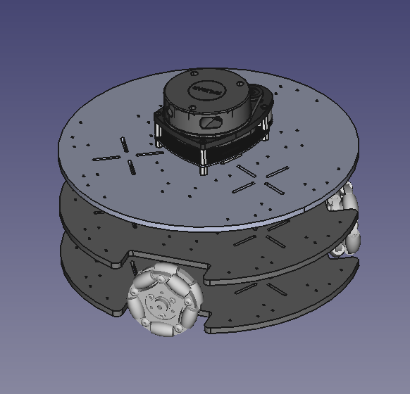

# \#100DaysOfROS

---

## Progress

 

---

## Goals
 - Improve ROS1 and `roscpp` proficiency.
 - Learn ROS2.
 - Learn to create gazebo plugins.
 - Sensor Fusion and SLAM with ROS.
 - Build a ROS enabled AMR

### Day 0:
**Tasks**
 - Setup noetic & foxy
 - Setup neovim for ROS development
    - Tried to get [vim-ros](https://github.com/taketwo/vim-ros/tree/master) working.
    - Autocompletion with neovim and LSP

 **Progress**
  - Autocompletion with neovim 0.5 failed. Will look at other options.

---
### Day 1:
**Tasks**
  - Refresher: Watch [Programming for Robotics (ROS) Course 1](https://www.youtube.com/watch?v=0BxVPCInS3M)
    - ROS architecture and philosophy
    - ROS master and nodes
    - Topics and messages
    - Console commands
    - Catkin workspace and build system
    - Launch files
    - Gazebo

**Progress**
  - Tried out various console commands.
  - Created a launch file to visualize the robot in rviz - [commit](https://github.com/4lhc/AMR_omnibot/commit/e5f286d3e7b4aee20e390257876a56f43ea80b9c)

---
### Day 2:
**Tasks**
  - Watch [Programming for Robotics (ROS) Course 2](https://www.youtube.com/watch?list=PLE-BQwvVGf8HOvwXPgtDfWoxd4Cc6ghiP&v=jYqDnuxTwK8&feature=youtu.be)
    - Initialization of the nodes
    - NodeHandles

**Progress**
  - Learned
  [`ros::init()`](http://wiki.ros.org/roscpp/Overview/Initialization%20and%20Shutdown) and its various invocations.
  - Learned about different types of [`NodeHandles`](http://wiki.ros.org/roscpp/Overview/NodeHandles)
  - Learned  about various [Logging](http://wiki.ros.org/roscpp/Overview/Logging) macros
  - [commit](https://github.com/4lhc/ROS-Learn/commit/de332e37361db77c22a53e2b7f0a70b36157ac3c)

--- 
### Day 3:
**Tasks**
  - Watch [Programming for Robotics (ROS) Course 2](https://www.youtube.com/watch?list=PLE-BQwvVGf8HOvwXPgtDfWoxd4Cc6ghiP&v=jYqDnuxTwK8&feature=youtu.be)
    - Subscribers and Publishers
    - ROS parameter server.

**Progress**
  - Edit `CmakeLists.txt` to create multiple nodes.
  - Created subscriber and publisher [nodes](https://github.com/4lhc/ROS-Learn/tree/master/noetic_test_ws/src/test_pkg_1/src)
  - Learned [`rosparam`](http://wiki.ros.org/roscpp/Overview/Parameter%20Server) syntax.
  - Misc:
    - Setup ROS Qt Creator
    [plug-in](https://ros-qtc-plugin.readthedocs.io/en/latest/)
    - Fixed neovim LSP completion.
    - Got [vim-ros](https://github.com/taketwo/vim-ros/tree/master) working in noetic

---
### Day 4:
**Tasks**
  - Watch [Programming for Robotics (ROS) Course 3](https://youtu.be/_GgHFuib_LU?list=PLE-BQwvVGf8HOvwXPgtDfWoxd4Cc6ghiP&t=696)
    - [URDF](http://wiki.ros.org/urdf/Tutorials/Building%20a%20Visual%20Robot%20Model%20with%20URDF%20from%20Scratch)

**Progress**
  - Created a basic urdf (visual only) for 3-wheeled [omnibot](https://github.com/4lhc/AMR_omnibot/blob/master/src/omnibot_description/urdf/omnibot.urdf). 

---
### Day 5:
**Tasks**
  - [Xacro](http://wiki.ros.org/xacro)

**Progress**
  - Created macros for wheel link and joints - [omnibot](https://github.com/4lhc/AMR_omnibot/blob/master/src/omnibot_description/urdf/omnibot.urdf).

---
### Day 6:
**Tasks**
  - Watch [Programming for Robotics (ROS) Course 3](https://youtu.be/_GgHFuib_LU?list=PLE-BQwvVGf8HOvwXPgtDfWoxd4Cc6ghiP)
    -[TF](https://wiki.ros.org/tf2)

**Progress**
  - Tried out different cmd line `tf` tools.
    - `tf_monitor`, `tf_echo` and `view_frames`
  - [Quaternion Basics](https://wiki.ros.org/tf2/Tutorials/Quaternions)
    - Tested different quaternion operations -- Creating quaternion from rpy,
    rotations and conversion between `tf2::Quaternion` and `geometry_msgs::Quaternion`
  - Started writing a `tf2_static_broadcaster`
  - [Today's Work](https://github.com/4lhc/ROS-Learn/tree/master/noetic_test_ws/src/tf_pkg)

---
### Day 7:
**Tasks**
  - tf2

**Progress**
  - Wrote tf2 broadcaster.
    - [`tf2_ros::TransformBroadcaster`](http://docs.ros.org/en/jade/api/tf2_ros/html/c++/classtf2__ros_1_1TransformBroadcaster.html)
    - Creating callback functions for `/odom` topic
    - [Today's Work](https://github.com/4lhc/ROS-Learn/tree/master/noetic_test_ws/src/tf_pkg)

---
### Day 8:
**Tasks**
  - Today I planned to finish adding lidar and meshes to the robot urdf. But
  spend too much time on freecad trying to fix the origin of an imported wheels. 

**Progress**
  - Created meshes for
  [`omnibot_description`](https://github.com/4lhc/AMR_omnibot/tree/master/src/omnibot_description/meshes) urdf geometry.

---
### Day 9:
**Tasks**
  - Start work on CAD model 

**Progress**
  - Created base and started assembly.
  - Fix origin errors with meshes

  

        
  

---
### Day 10:
**Tasks**
  -  Watch [Programming for Robotics (ROS) Course 4](https://www.youtube.com/watch?v=feXC7aQrkeM&list=PLE-BQwvVGf8HOvwXPgtDfWoxd4Cc6ghiP&index=4)
    - Create a service file
    - Write a service client in `roscpp`

**Progress**
  - Created a service client and service message. 
  - Had trouble with empty service request [TODO]
  - [Today's Work](https://github.com/4lhc/AMR_omnibot/tree/master/src/omnibot_teleop/src)

**Note**
  - Designing the omnibot model requires a sizeable chunk of time,
  which I'm lacking this week. Hence, I decided to resume learning `roscpp` and
  put the robot design on hold for the week. The current CAD model is for
  visualization only and it is not what something I want it to be. 

---
### Day 11:
**Tasks**
  - Continue with [ROS
  Services](http://wiki.ros.org/roscpp/Overview/Services#Service_definitions.2C_request_messages_and_response_messages)
    - Write a service server in `roscpp`

**Progress**
  - Created a service server.
  - Learned to create persistent connections to services
  - Different callback types that can be used for the ServiceServer: Functions, Class
  Methods and Functors
  - Create headers to pass meta information about the client.
  - [Today's Work](https://github.com/4lhc/AMR_omnibot/tree/master/src/omnibot_teleop/src)

---
### Day 12:
**Tasks**
  - Learn [Timers](http://wiki.ros.org/roscpp/Overview/Timers)

**Progress**
  - Created Timer callbacks of different flavours - Function, class methods.
  - Explored various members of `struct TimerEvent` - `last_expected`,
  `last_real` etc
  - [Today's Work](https://github.com/4lhc/ROS-Learn/blob/master/noetic_test_ws/src/test_pkg_1/src/test_pkg_1_timer_node.cpp)

---
### Day 13:
**Tasks**
  - Learn [Clock](http://wiki.ros.org/Clock) &
  [Time](http://wiki.ros.org/roscpp/Overview/Time)
  - Learn [Callbacks & Spinning](http://wiki.ros.org/roscpp/Overview/Callbacks%20and%20Spinning)

**Progress**
  - Learned about `ros::Time`, `ros::Duration` and `ros::Rate` examples.
  - Use `WallTime`, `WallDuration` and `WallRate` when wall-clock is needed.
  - Use `Timers` over `Rate`.
  - `Rate` tries to maintain rate for a loop.
  - Learned about single threaded spinners and experimented with `ros::spin()`
  and `ros::spinOnce()`
  - Found couple of good sources to learn more about ROS callbacks and spinners
    - [Do Timers run in different threads?](https://answers.ros.org/question/367223/do-timers-run-in-different-threads-roscpp/?answer=367455#post-id-367455)
    - [ROS Spinning, Threading,
    Queuing by Kohei Otsuka](https://levelup.gitconnected.com/ros-spinning-threading-queuing-aac9c0a793f)
  - [Today's Work](https://github.com/4lhc/ROS-Learn/commit/46a366141653e44a92f8ad17909a891e1be94230)

---
### Day 14:
**Tasks**
 - Try out some ros packages and build something interesting
   - `aruco_ros` for 6-dof pose estimation. 
   - `follow_waypoints` 

**Progress**
  - [`aruco_ros`](https://github.com/pal-robotics/aruco_ros) doesn't have noetic 
    support yet, so I created a fork [`aruco_ros-noetic`](https://github.com/4lhc/aruco_ros/tree/noetic-devel)
  - Successfully installed follow_waypoints

---
### Day 15:
**Tasks**
 - Create launch file for aruco marker publisher.
 - Write a node to check if a given list of markers are present in the world

**Progress**
 - Created a world with aruco markers
   - Generated aruco marker models to be added to the world
 - Launch file for `marker_publisher`
 - Started writing a marker counter
 [node](https://github.com/4lhc/ROS-Learn/commit/2bc6c143c091e3878df665778b026a9ccf72c164). 

---
### Day 16:
**Tasks**
 - Continue yesterday's work 

**Progress**
 - Issues: After moving the marker models to local directory, the markers were visible
 in gazebo, but were not visible via camera plugin output. ie; the markers were
 invisible when the camera topic is visualized in `rqt_gui`
  - As a temporary fix, the models were moved to `~/.gazebo/models`
 - Finished writing a node to check if a list of aruco markers are present in the
 world.
 [link](https://github.com/4lhc/ROS-Learn/blob/master/AMR_ws/src/custom_bot_nav/src/custom_bot_check_marker.cpp)

---
### Day 17:
**Tasks**
 - [`Actionlib`](http://wiki.ros.org/actionlib)
 - Write an actionclient for
 `move_base` to send waypoints to the robot.

**Progress**
 - Started creating an [action client](https://github.com/4lhc/ROS-Learn/tree/master/AMR_ws/src/custom_bot_nav/src) for move_base.

---
### Day 18:
**Tasks**
  - Finish writing action client for move_base
  - Load waypoints to rosparam server from yaml file.

**Progress**
  - Successfully completed waypoint mission with move_base action client.
  [link](https://github.com/4lhc/ROS-Learn/blob/master/AMR_ws/src/custom_bot_nav/src/custom_bot_waypoints.cpp)
  - Created yaml file with params (waypoints and markers), loaded it into
  parameter server and read it from the node.
  - Fix inflation radius to prevent the robot from getting stuck in the maze
  world.

---
### Day 19:
**Tasks**
  - Continue learning [actionlib](http://wiki.ros.org/actionlib_tutorials/Tutorials)

**Progress**
  - Created an action
  [message.](https://github.com/4lhc/ROS-Learn/blob/master/noetic_test_ws/src/robot_msgs/action/Blink.action)
  - Wrote an action
  [client.](https://github.com/4lhc/ROS-Learn/blob/master/noetic_test_ws/src/robot/src/blink_action_client.cpp)
  - Started writing action [server.](https://github.com/4lhc/ROS-Learn/blob/master/noetic_test_ws/src/robot/src/blink_action_server.cpp)

---
### Day 20:
**Tasks**
  - Today I try to setup and test [rosserial](http://wiki.ros.org/rosserial) on an arduino mega and a tiva
  evaluation board (TM4C123GXL).

**Progress**
  - Installed `rosserial-arduino`
    - In the IDE, library version 0.7.9 seems to work, while the latest verison
    (0.9.1) available fails to compile the sketch.
    -  After uploading the sketch, `rosrun rosserial_python serial_node.py
    /dev/ttyUSB0` was run to rosserial client application.

---
Day skipped due to academic work.

---
### Day 21:
**Tasks**
 - `actionlib` - Write simpleActionServer with GoalCallBack.

**Progress**
 - I rewrote the action server script that I wrote on Day 19, with goalcallback.
 I struggled a bit with the roswiki tutorials on actionlib. Need to find
 a better resource to learn.
 - Note: In the streak tracker, today's commit will count towards the next day, as I am commiting after
 midnight.

---
### Day 22:
**Tasks**
 - [`rviz` visualisation.](http://wiki.ros.org/visualization/Tutorials)
 - `actionlib` will be put on hold until I find a better tutorial.

**Progress**
 - Started writing rviz marker visualisation

---
### Day 23:
**Tasks**
 - [`rviz` visualisation.](http://wiki.ros.org/visualization/Tutorials)

**Progress**
 - Learned to add basic shapes to rviz
